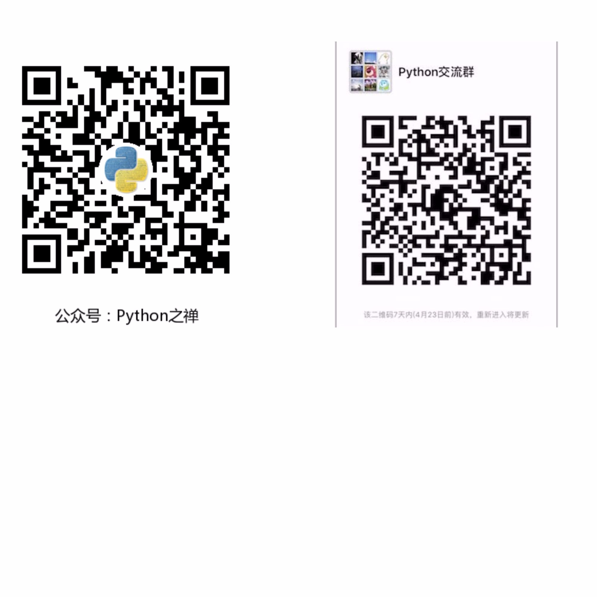

## 项目简介

Zhihu API For Humans Based on Python3

## 前置条件

* Python3.x
* Requests2
* BeautifulSoup4

## 安装

```python
git@github.com:lzjun567/zhihu-api.git
cd  zhihu-api
pip install -r requirement.txt
```

## API使用

### 获取用户信息: zhihu.user(id)

获取用户信息时,接收的参数可以是用户的主页地址 profile_url,也可以是用户的个性化名字 user_slug

```
>>> from zhihu import Zhihu

>>> zhihu = Zhihu()

>>> zhihu.user(profile_url="https://www.zhihu.com/people/xiaoxiaodouzi")

>>> zhihu.user(user_slug="xiaoxiaodouzi")
{'avatar_url_template': 'https://pic1.zhimg.com/v2-ca13758626bd7367febde704c66249ec_{size}.jpg', 'badge': [], 'name': '我是小号', 'headline': '程序员', 'gender': -1, 'user_type': 'people', 'is_advertiser': False, 'avatar_url': 'https://pic1.zhimg.com/v2-ca13758626bd7367febde704c66249ec_is.jpg', 'url': 'http://www.zhihu.com/api/v4/people/1da75b85900e00adb072e91c56fd9149', 'type': 'people', 'url_token': 'xiaoxiaodouzi', 'id': '1da75b85900e00adb072e91c56fd9149', 'is_org': False}

```

### 发私信: zhihu.send_message(id)

获取用户信息时,接收的参数可以是用户的主页地址 profile_url,也可以是用户的个性化名字 user_slug, 还可以是用户的id


```python
>>> zhihu.send_message("你好,问候1", profile_url="https://www.zhihu.com/people/xiaoxiaodouzi")
{'sender': {'avatar_url_template': 'https://pic3.zhimg.com/ca6bf4bb82d9cf152b618edcbda01606_{size}.jpg', 'badge': [], 'name': 'zhijun liu', 'is_advertiser': False, 'url': 'http://www.zhihu.com/api/v4/people/ba286d02fd9701a446d68ba85d0755c0', 'url_token': 'zhijun-liu', 'user_type': 'people', 'headline': '公众号：Python之禅', 'avatar_url': 'https://pic3.zhimg.com/ca6bf4bb82d9cf152b618edcbda01606_is.jpg', 'is_org': False, 'gender': 1, 'type': 'people', 'id': 'ba286d02fd9701a446d68ba85d0755c0'}, 'url': '', 'has_read': False, 'content': '你好,问候1', 'receiver': {'avatar_url_template': 'https://pic1.zhimg.com/v2-ca13758626bd7367febde704c66249ec_{size}.jpg', 'badge': [], 'name': '我是小号', 'is_advertiser': False, 'url': 'http://www.zhihu.com/api/v4/people/1da75b85900e00adb072e91c56fd9149', 'url_token': 'xiaoxiaodouzi', 'user_type': 'people', 'headline': '程序员', 'avatar_url': 'https://pic1.zhimg.com/v2-ca13758626bd7367febde704c66249ec_is.jpg', 'is_org': False, 'gender': -1, 'type': 'people', 'id': '1da75b85900e00adb072e91c56fd9149'}, 'created_time': 1492318772, 'type': 'message', 'id': '2143862420'}

>>> zhihu.send_message("你好,问候2", user_slug="xiaoxiaodouzi")
{'sender': {'avatar_url_template': 'https://pic3.zhimg.com/ca6bf4bb82d9cf152b618edcbda01606_{size}.jpg', 'name': 'zhijun liu', 'is_advertiser': False, 'url': 'http://www.zhihu.com/api/v4/people/ba286d02fd9701a446d68ba85d0755c0', 'badge': [], 'user_type': 'people', 'url_token': 'zhijun-liu', 'headline': '公众号：Python之禅', 'avatar_url': 'https://pic3.zhimg.com/ca6bf4bb82d9cf152b618edcbda01606_is.jpg', 'is_org': False, 'gender': 1, 'type': 'people', 'id': 'ba286d02fd9701a446d68ba85d0755c0'}, 'url': '', 'has_read': False, 'content': '你好,问候2', 'receiver': {'avatar_url_template': 'https://pic1.zhimg.com/v2-ca13758626bd7367febde704c66249ec_{size}.jpg', 'name': '我是小号', 'is_advertiser': False, 'url': 'http://www.zhihu.com/api/v4/people/1da75b85900e00adb072e91c56fd9149', 'badge': [], 'user_type': 'people', 'url_token': 'xiaoxiaodouzi', 'headline': '程序员', 'avatar_url': 'https://pic1.zhimg.com/v2-ca13758626bd7367febde704c66249ec_is.jpg', 'is_org': False, 'gender': -1, 'type': 'people', 'id': '1da75b85900e00adb072e91c56fd9149'}, 'created_time': 1492318780, 'type': 'message', 'id': '6343862420'}

>>> zhihu.send_message("你好,问候3", user_id="1da75b85900e00adb072e91c56fd9149")
{'sender': {'avatar_url_template': 'https://pic3.zhimg.com/ca6bf4bb82d9cf152b618edcbda01606_{size}.jpg', 'name': 'zhijun liu', 'is_advertiser': False, 'url': 'http://www.zhihu.com/api/v4/people/ba286d02fd9701a446d68ba85d0755c0', 'badge': [], 'user_type': 'people', 'url_token': 'zhijun-liu', 'headline': '公众号：Python之禅', 'avatar_url': 'https://pic3.zhimg.com/ca6bf4bb82d9cf152b618edcbda01606_is.jpg', 'is_org': False, 'gender': 1, 'type': 'people', 'id': 'ba286d02fd9701a446d68ba85d0755c0'}, 'url': '', 'has_read': False, 'content': '你好,问候3', 'receiver': {'avatar_url_template': 'https://pic1.zhimg.com/v2-ca13758626bd7367febde704c66249ec_{size}.jpg', 'name': '我是小号', 'is_advertiser': False, 'url': 'http://www.zhihu.com/api/v4/people/1da75b85900e00adb072e91c56fd9149', 'badge': [], 'user_type': 'people', 'url_token': 'xiaoxiaodouzi', 'headline': '程序员', 'avatar_url': 'https://pic1.zhimg.com/v2-ca13758626bd7367febde704c66249ec_is.jpg', 'is_org': False, 'gender': -1, 'type': 'people', 'id': '1da75b85900e00adb072e91c56fd9149'}, 'created_time': 1492318799, 'type': 'message', 'id': '3244862420'}
>>>
```

## TODO

* 关注
* 文章点赞
* ...

## 贡献者
欢迎 PR, 所有贡献者都将出现在这里

## 交流



